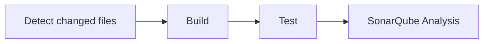

# sonarqube-compose

Local SonarQube stack for demos/testing, run via Docker Compose.

## Overview

`compose.yaml` defines a core stack plus two opt-in profiles:

- **Core** (always started): `db` (Postgres) → `sonarqube`, connected over
  the default Compose network. Both are only bound to `127.0.0.1`.
- **`monitoring` profile**: `prometheus` scrapes SonarQube's
  `/api/monitoring/metrics` endpoint (authenticated via a passcode) for
  server/process health, and `sonarqube-prometheus-exporter` (a separate service,
  published from the sibling
  [`sonarqube-prometheus-exporter`](https://github.com/rmrighes-sonar/sonarqube-prometheus-exporter)
  repo) for project/portfolio quality data that endpoint doesn't cover.
  `blackbox-exporter` (the generic, off-the-shelf Prometheus exporter — no
  custom code, just a static config file) probes `mcp`'s `/health` endpoint
  and `ngrok`'s local inspector API so their reachability shows up in
  Prometheus/Grafana too, since neither exposes its own metrics. `grafana`
  visualizes all of this through two pre-provisioned dashboards — see
  [Dashboards](#dashboards) below.
- **`share` profile**: `ngrok` tunnels the local SonarQube instance to a
  fixed public hostname, for sharing access outside your machine.

All services declare healthchecks, and dependent services wait on
`service_healthy` before starting (e.g. `prometheus`/`ngrok` wait for
SonarQube to actually be serving requests, not just for the container to
have started).

## Setup

1. Copy `.env.example` to `.env` and fill in real values:
   ```bash
   cp .env.example .env
   ```
   `.env` is gitignored and must never be committed.
2. Review [Prerequisites](#prerequisites) below.
3. Start the stack:
   ```bash
   docker compose up -d                          # core: SonarQube + Postgres
   docker compose --profile monitoring up -d     # + Prometheus + Grafana
   docker compose --profile share up -d          # + ngrok tunnel
   ```
   Profiles can be combined, e.g. `docker compose --profile monitoring --profile share up -d`.

## Ports & credentials

| Service    | URL                          | Credentials                                             |
|------------|-------------------------------|----------------------------------------------------------|
| SonarQube  | http://localhost:9000        | default admin/admin on first login                       |
| Prometheus | http://localhost:9090        | none (local only)                                         |
| Grafana    | http://localhost:3000        | `admin` / `GRAFANA_ADMIN_PASSWORD` (from `.env`)          |
| sonarqube-prometheus-exporter | http://localhost:9091/metrics | none (local only) — raw Prometheus exposition, for debugging |
| ngrok      | http://localhost:4040 (inspector) / `NGROK_URL` (public) | n/a |

## Dashboards

Grafana (`monitoring` profile) is pre-provisioned with two dashboards in a
"SonarQube" folder:

- **SonarQube Server Health** (`grafana/dashboards/sonarqube-health.json`) —
  availability of the Web/Compute Engine/Elasticsearch processes, license
  usage, Elasticsearch disk health, Compute Engine task throughput/duration,
  Web API v1/v2 request rate and p95 latency, database query rate/latency,
  external integration health, connected SonarLint clients, and MCP server /
  ngrok tunnel reachability (via `blackbox-exporter` probes — see "External
  Services" row; shows "Down" when the `mcp`/`share` profiles aren't running
  alongside `monitoring`, same graceful-down behavior as the SonarQube
  panels above). The "Web & API performance" and "Database" rows require
  `SONAR_PERFORMANCEMONITORING_ENABLED: "true"` (set in `compose.yaml`) —
  SonarQube disabled this by default as of SONAR-27755 (2026-06-01); without
  it, `sonarqube_web_api_v1/v2_request_duration_seconds` and
  `sonarqube_db_query_duration_seconds` never receive samples (the
  interceptors that record them never fire), regardless of traffic volume,
  leaving those panels permanently empty.
  panels above). Backed entirely by the existing `Prometheus` datasource —
  no extra setup needed beyond the `monitoring` profile.

  **Troubleshooting "Could not find plugin definition for data source" /
  panels showing the Prometheus datasource as missing:** Grafana's
  background plugin installer re-checks every core-bundled plugin
  (including `prometheus`) on every startup regardless of what's set in
  `GF_PLUGINS_PREINSTALL`, and by default (`preinstall_auto_update`)
  deletes the currently-working bundled binary *before* fetching its
  replacement from `storage.googleapis.com`. On networks that
  intercept/proxy that host, the fetch fails, leaving the plugin
  uninstalled until a startup where the fetch happens to succeed — so
  every `docker compose down && up` could permanently break this
  dashboard. `compose.yaml` sets
  `GF_PLUGINS_PREINSTALL_AUTO_UPDATE=false` to stop Grafana from touching
  an already-installed bundled plugin; it still installs one fresh if
  truly missing. If you're recovering from this failure on an existing
  `grafana_data` volume (the bundled plugin directory lives in the
  image, not that volume, so a plain restart won't restore it), force a
  fresh container so it's re-extracted from the image:
  `docker compose up -d --force-recreate grafana`.

- **SonarQube Usage — Projects & Portfolios**
  (`grafana/dashboards/sonarqube-usage.json`) — a usage/quality snapshot
  for selected projects: KPI strip (failing gates, LoC, average coverage,
  vulnerabilities, bugs), analysis recency, quality-gate distribution,
  ranked issue charts, LoC by project, a formatted measures table (overall
  and new-code metrics, A–E ratings, links into SonarQube), and separate
  coverage/duplication vs LoC trend charts. Portfolios (Enterprise/
  Governance) and last-analysis-status are collapsed by default.

  Backed entirely by the `Prometheus` datasource — the same as the Health
  dashboard, and the same pattern for every panel in this dashboard now.
  SonarQube doesn't expose this project/portfolio data via its own
  `/api/monitoring/metrics` endpoint, so a separate service,
  **`sonarqube-prometheus-exporter`** (source:
  [`rmrighes-sonar/sonarqube-prometheus-exporter`](https://github.com/rmrighes-sonar/sonarqube-prometheus-exporter),
  published as a private image on `ghcr.io`), queries SonarQube's Web API on
  its own 60s schedule and re-exposes the results as ordinary
  `sonarqube_project_*`/`sonarqube_portfolio_*` Prometheus metrics —
  Grafana never calls SonarQube's Web API directly. See that repo's
  `README.md` for the full metric contract.

  Trend panels use the single-select **Project (history)** variable
  together with the dashboard's time range (default last 90 days) — this
  is real Prometheus history retained since the exporter started being
  scraped, not a call to SonarQube's `search_history` API. KPI/table/bar
  panels are an *instant* Prometheus query (current state), independent of
  the time range.

  **Project**, **Project (history)**, and **Portfolio** are real
  `query`-type variables using `label_values(sonarqube_project_info,
  project)` / `label_values(sonarqube_portfolio_info, portfolio)` — dynamic
  and auto-discovering (add/remove a SonarQube project and it appears or
  disappears here on the next scrape, no dashboard edits needed), and
  "All" works correctly. This directly replaces the static `custom`-type
  variables an earlier version of this dashboard needed as a workaround for
  the Infinity datasource's broken "All"-expansion behavior against this
  same API — Prometheus's own variable engine doesn't have that problem.

  To populate this dashboard:
  1. In SonarQube, generate a token: **My Account &gt; Security &gt; Generate
     Tokens** (or use a dedicated read-only service account). The token's
     user needs Browse permission on the projects/portfolios you want
     charted.
  2. Set `SONARQUBE_API_TOKEN` in `.env` to that token (now consumed by
     `sonarqube-prometheus-exporter`, not by Grafana directly).
  3. **One-time per machine**: log Docker in to GHCR so it can pull the
     private exporter image (`sonarqube-prometheus-exporter` is private, matching this
     repo's own visibility):
     ```bash
     gh auth token | docker login ghcr.io -u <your-github-username> --password-stdin
     ```
     (Requires the [`gh` CLI](https://cli.github.com/) authenticated with at
     least `read:packages` scope, and to be a collaborator on that repo. Any
     [personal access token](https://github.com/settings/tokens) with
     `read:packages` works the same way in place of `gh auth token`.)
  4. `docker compose --profile monitoring up -d` (or restart if already
     running): `docker compose up -d sonarqube-prometheus-exporter prometheus grafana`.

  Known limitations, inherited from `sonarqube-prometheus-exporter`: the exporter's
  own `/api/projects/search`, `/api/components/search`, and
  `/api/measures/search` calls rely on SonarQube's internal/undocumented
  measures-search endpoint (same caveat that applied when this dashboard
  called it directly) — see that repo's README for the stable fallback and
  full trade-offs (no history backfill from before the exporter existed;
  the old raw "recent analyses" event list is now a last-status-per-project
  gauge instead of a log with exact timestamps/errors).

  **Troubleshooting an empty usage dashboard:**
  - Check `sonarqube_prometheus_exporter_up` in Prometheus/Explore — `0` means the
    exporter's last scrape of SonarQube's Web API failed; check
    `docker compose logs sonarqube-prometheus-exporter` for the specific API error
    (commonly an invalid/expired `SONARQUBE_API_TOKEN`, or the token's user
    lacking Browse permission).
  - If `sonarqube-prometheus-exporter` won't even start (image pull error), confirm
    step 3 above — `docker compose logs sonarqube-prometheus-exporter` will show
    `unauthorized`/`denied` if the machine isn't logged in to `ghcr.io`.
  - Check Prometheus's Targets page (`http://localhost:9090/targets`) for
    the `sonarqube-prometheus-exporter` job's health and `lastError`.

## GitHub Integration

This SonarQube instance can be bound to GitHub (personal account
`rmrighes-sonar`) via a GitHub App, enabling repository import, branch/PR
analysis, and pull request decoration (quality gate status posted as a
GitHub check/comment). CI scanning workflows in the integrated repos
(`sonarqube-compose`, `sonarqube-prometheus-exporter`) push analysis results to this
server over the `share` profile's `ngrok` tunnel, since GitHub-hosted
Actions runners can't reach `localhost` or your LAN directly.

**Why `ngrok` is required here:** two things need the local SonarQube
instance to be publicly reachable —
- GitHub's "Install & Authorize" redirect during GitHub App creation (a
  browser round-trip back to SonarQube).
- GitHub-hosted Actions runners calling `SONAR_HOST_URL` to push analysis
  results.

PR decoration itself (SonarQube posting a check/comment) is an *outbound*
call from SonarQube to GitHub's API, so it doesn't need any extra exposure
beyond the above.

### One-time setup (manual, in a browser — not scriptable)

1. Start the tunnel: `docker compose --profile share up -d`, and confirm
   `NGROK_URL` (from `.env`) is live.
2. In SonarQube: **Administration > Configuration > General Settings >
   General**, set **Server base URL** to your `NGROK_URL`. Required, or the
   GitHub App redirect and PR-decoration links break.
3. In SonarQube: **Administration > Configuration > General Settings >
   DevOps Platform Integrations > GitHub tab > Create app for me**. This
   redirects to GitHub, generates a manifest-based GitHub App under your
   `rmrighes-sonar` account, and on **Install & Authorize** saves the App
   ID / Client ID / Client Secret / Private Key back into a new GitHub
   Configuration record automatically.
   - When prompted where to install the app, choose **All repositories**
     so future repos are covered automatically, not just the current two.
4. Back in SonarQube: **Projects > Create Project > GitHub**, select the
   new configuration, and import `rmrighes-sonar/sonarqube-compose` and
   `rmrighes-sonar/sonarqube-prometheus-exporter`. This binds each project to its
   GitHub repo (enables branch/PR analysis + decoration once a scan runs).
5. Generate a project analysis token per repo: **My Account > Security >
   Generate Tokens** (type: Project Analysis Token) — or reuse a single
   token across both repos if you prefer less setup.
6. Push the CI connection settings into each repo (no browser needed):
   ```bash
   gh secret set SONAR_TOKEN -R rmrighes-sonar/sonarqube-prometheus-exporter -b "<token>"
   gh variable set SONAR_HOST_URL -R rmrighes-sonar/sonarqube-prometheus-exporter -b "<NGROK_URL>"
   gh secret set SONAR_TOKEN -R rmrighes-sonar/sonarqube-compose -b "<token>"
   gh variable set SONAR_HOST_URL -R rmrighes-sonar/sonarqube-compose -b "<NGROK_URL>"
   ```

### CI scanning

Both repos have a `sonar-project.properties` file and a GitHub Actions job
(using `SonarSource/sonarqube-scan-action`) that scans on `push` and
`pull_request` and pushes results to `SONAR_HOST_URL`. See each repo's
`.github/workflows/` for the exact job.

**Caveats:**
- CI scans only succeed while the local Docker stack *and* the `ngrok`
  tunnel are both running — GitHub-hosted runners can't reach SonarQube
  otherwise.
- `NGROK_URL` and the SonarQube Server base URL must stay in sync: if the
  ngrok URL ever changes (new plan/session), update both the SonarQube
  Server base URL setting and the `SONAR_HOST_URL` repo variables.

## MCP Server

SonarQube Server (2026.3+, Developer/Enterprise/Data Center editions)
bundles a hosted MCP ([Model Context Protocol](https://modelcontextprotocol.io/))
proxy, letting AI coding agents (e.g. Cursor) query issues, quality gates,
and measures directly, through a single `/mcp` endpoint that SonarQube
itself exposes. It's opt-in via the `mcp` profile — it adds another
container (memory) that most sessions don't need running.

**No `ngrok`/`share` profile involved.** Unlike the GitHub integration,
this doesn't need public exposure: an MCP client (Cursor) runs locally on
the same machine as this stack, and `sonarqube`'s port is already published
to `127.0.0.1:9000` — so it connects straight to `http://localhost:9000/mcp`.
The ngrok URL (`https://<NGROK_URL>/mcp`) would only matter if connecting
an MCP client from a different machine.

1. Set `MCP_VERSION` in `.env` to the MCP Server version compatible with
   your `SONARQUBE_IMAGE` version — see the
   [compatibility table](https://docs.sonarsource.com/sonarqube-mcp-server/setup/sonarqube-server-hosted).
2. `docker compose --profile mcp up -d` (combine with other profiles as
   needed, e.g. `--profile monitoring --profile mcp`).
3. In SonarQube, generate a user token: **My Account > Security > Generate
   Tokens**.
4. Configure your MCP client. For Cursor, use SonarQube's
   [MCP config generator](https://docs.sonarsource.com/sonarqube-mcp-server/setup/sonarqube-server-hosted#step-2-configure-your-agent) —
   select **Remote server (HTTP)**, server URL `http://localhost:9000/mcp`,
   and your token from step 3. Restart Cursor and run `/mcp` to confirm the
   SonarQube tools are available.

**Verify:** In SonarQube, **Administration > System Info > System > MCP**
should show `Enabled: true, Healthy: true` once the `mcp` container is up
(it shows `Healthy: false` whenever the profile isn't running — expected,
not an error). `docker compose logs mcp` for troubleshooting the container
itself.

## CI Pipeline

Every push to `main` and every pull request runs a single workflow,
[`.github/workflows/ci.yml`](.github/workflows/ci.yml), with three jobs
chained via `needs:` so the whole thing renders as one linear graph on the
Actions run page:



- **`changes`** -- always runs first; diffs the push/PR against its base
  commit to detect whether *only* `CHANGELOG.md` /
  `.release-please-manifest.json` changed (i.e. this is release-please's own
  commit). See "Release commits are skipped" below for why this exists as a
  job instead of a simpler trigger-level filter.
- **`build`** -- fast, cheap validation that the tracked config is
  well-formed: `docker compose config -q` against the base stack and every
  profile combination (`monitoring`, `share`, `mcp`, all three), `shellcheck`
  on `scripts/*.sh`, and JSON validation of the Grafana dashboards. Fails in
  seconds instead of waiting on the smoke test below.
- **`test`** (needs `build`) -- a smoke test: brings up the core + `monitoring`
  profile with throwaway config (`cp .env.example .env`, no real secrets
  needed) via `docker compose up -d --wait`, asserts every container reports
  healthy, then tears it down. Limited to `monitoring` -- `share` needs a
  real `NGROK_AUTHTOKEN` and `mcp` adds little smoke-test value beyond what
  core + monitoring already exercises (Postgres, SonarQube, Prometheus,
  Grafana, the exporter, blackbox-exporter).
- **`sonarqube`** (needs `test`) -- only scans once the config has proven it
  actually starts a healthy stack. Requires `SONAR_TOKEN` (secret) and
  `SONAR_HOST_URL` (variable) -- see [GitHub Integration](#github-integration).

**Release commits are skipped -- via job-level `if:`, not `paths-ignore`:**
release-please's Release PRs (and the commit that merges one) only ever
touch `CHANGELOG.md` / `.release-please-manifest.json`, so there's nothing
new for `build`/`test`/`sonarqube` to validate there -- see
[Releases](#releases) below. It's tempting to skip this with `paths-ignore`
on the workflow's triggers, but **don't**: `build`/`test`/`sonarqube` are
required status checks in branch protection, and a workflow that never runs
at all for a given commit leaves those checks stuck as "Expected" forever
-- unmergeable, with no override since `main`'s protection also enforces
against admins. Instead, `changes` always runs (so the checks always get a
chance to report), and `build` skips its real work via
`if: needs.changes.outputs.release_only != 'true'` -- `test` and
`sonarqube` then skip too automatically, cascading through their `needs:`
chain (a job's default condition requires its dependencies to have
succeeded; skipped doesn't count as succeeded). A job skipped via `if:`
reports conclusion "skipped", which GitHub explicitly treats as passing for
required status checks -- unlike a check that never ran.

**`main` is protected:** merging requires an open pull request with `build`,
`test`, and `sonarqube` all green, and direct pushes/force-pushes/deletion
of `main` are blocked. There's intentionally no required-approval count --
GitHub never allows an account to approve its own pull request, and this
repo has a single maintainer, so requiring N approvals would make every PR
permanently unmergeable. The gate is "a PR exists and CI is green," not
human sign-off.

**Known bottleneck:** SonarQube here is self-hosted, reachable only through
the `share` profile's `ngrok` tunnel (see [GitHub Integration](#github-integration)).
If the local stack or tunnel isn't up when CI runs, the `sonarqube` job
fails -- and since it's a required check, that blocks every merge to `main`
until the local stack is back up.

## Releases

Versioning follows [Semantic Versioning](https://semver.org/), automated by
[release-please](https://github.com/googleapis/release-please) (see
`.github/workflows/release-please.yml`,
[release-please-config.json](release-please-config.json), and
[.release-please-manifest.json](.release-please-manifest.json)). Unlike
`sonarqube-prometheus-exporter`, this repo doesn't publish a build artifact of its own
-- a release here is just a version marker + generated `CHANGELOG.md` entry
for the stack's compose/dashboard/script configuration, useful as a
"known-good checkpoint" to reference or roll back to.

To get a correct version bump, commits to `main` must follow
[Conventional Commits](https://www.conventionalcommits.org/):

- `fix:` -- patch release (e.g. a dashboard/healthcheck bug fix).
- `feat:` -- minor release (e.g. a new dashboard or compose service).
- `fix!:` / `feat!:` / a `BREAKING CHANGE:` footer -- major release (e.g. a
  renamed environment variable or removed service).
- `chore:`, `docs:`, `refactor:`, `test:`, `ci:` -- no release triggered on
  their own.

release-please maintains a standing "Release PR" that accumulates changes
since the last release; merging it cuts the actual git tag, GitHub Release,
and `CHANGELOG.md` entry. (This repo previously had one ad hoc, non-standard
tag, `VER-1.0.0` -- harmless leftover, safe to ignore; release-please's own
tags follow the standard `vX.Y.Z` format going forward.)

**CI approval gate on the Release PR:** without a `RELEASE_PLEASE_TOKEN`
repo secret, the Release PR is authored by `github-actions[bot]` (via the
default `GITHUB_TOKEN`), and GitHub requires a maintainer to manually
approve its `pull_request`-triggered CI runs before they execute --
[a same-repo, non-fork security gate GitHub added
2026-06-11](https://github.blog/changelog/2026-06-11-bot-created-pull-requests-can-run-workflows-if-approved/)
that applies to every bot-authored PR, not just first-time contributors.
This recurs on every release until fixed. To remove it, add a repo secret
`RELEASE_PLEASE_TOKEN` (a fine-grained PAT scoped to this repo with
**Contents: read/write** and **Pull requests: read/write**, or a GitHub App
installation token) -- `.github/workflows/release-please.yml` already wires
it in with a `GITHUB_TOKEN` fallback, so nothing else needs to change once
the secret exists.

## Prerequisites

SonarQube bundles an embedded Elasticsearch instance, which requires the
host's `vm.max_map_count` to be at least `262144`. If this isn't set,
SonarQube will fail to start (often with an Elasticsearch bootstrap error in
its logs).

- **Linux:**
  ```bash
  sudo sysctl -w vm.max_map_count=262144
  ```
  To persist across reboots, add `vm.max_map_count=262144` to
  `/etc/sysctl.conf` (or a file under `/etc/sysctl.d/`).

- **macOS / Windows with Docker Desktop:** the Linux kernel actually backing
  your containers runs inside Docker Desktop's VM, so the sysctl above must
  be applied to that VM, not your host OS. Run:
  ```bash
  docker run --rm --privileged --pid=host justincormack/nsenter1 sysctl -w vm.max_map_count=262144
  ```
  This needs to be re-applied whenever the Docker Desktop VM restarts (e.g.
  after a reboot or Docker Desktop restart).

- **Memory/CPU:** in Docker Desktop, allocate at least 4 GB RAM and 2 CPUs
  to the Docker VM (Settings → Resources) — SonarQube plus its Elasticsearch
  index needs headroom beyond the container's own `deploy.resources` limits
  configured in `compose.yaml`.

## JVM heap sizing

SonarQube runs three separate JVMs inside the `sonarqube` container:
**Web** (UI/API), **Compute Engine** (background task processing), and an
embedded **Elasticsearch** ("search", the index behind global/project
search and issue queries). Each has its own heap, sized in `compose.yaml`
via `SONAR_WEB_JAVAOPTS`, `SONAR_CE_JAVAOPTS`, and `SONAR_SEARCH_JAVAOPTS`.

This image's un-tuned defaults (visible via
`docker compose exec sonarqube grep javaOpts /opt/sonarqube/conf/sonar.properties`)
total up to ~6G of declared JVM memory (Web `-Xmx1G`, CE `-Xmx2G`, Search
`-Xmx2G` + `1G` direct memory) against the container's 4g memory limit — a
gap normally invisible under light, bursty local demo traffic, but a latent
OOM-kill risk under real concurrent load, since Docker enforces the
container limit as a hard cap regardless of what the JVMs think they're
allowed to use.

`compose.yaml` right-sizes all three instead for this stack's actual
profile (one or a few small local projects, one analysis at a time, one
interactive user): Web `-Xmx512m`, CE `-Xmx1G`, Search `-Xmx768m`/`-Xms768m`
+ `256m` direct memory — 2.56G declared max, leaving ~1.5G of the 4g limit
for per-process overhead (metaspace, thread stacks, JIT code cache). It also
adds `-XX:+ExitOnOutOfMemoryError` (fail fast instead of limping on
degraded) and points `-XX:HeapDumpPath` at the already-mounted
`sonarqube_logs` volume, so any OOM heap dump survives a container restart
for post-mortem debugging instead of landing on ephemeral container-local
disk.

**When to raise these:** analyzing larger/more projects, increasing
Compute Engine worker count (**Administration > Projects > Background
Tasks > Number of Workers**, an Enterprise/Data Center Edition feature —
scale CE heap roughly proportionally to worker count), or seeing OOM kills
in `docker compose logs sonarqube` / `docker stats`. Scale
`deploy.resources.limits.memory`/`reservations.memory` on the `sonarqube`
service up alongside any heap increase — the container limit is a hard
ceiling above the JVMs' own heaps plus their fixed overhead.

## Image policy

This stack intentionally tracks the latest release on every image
(SonarQube's rolling `enterprise` tag, and `latest` for Prometheus/Grafana/
blackbox-exporter) for simplicity in local demos, rather than pinning to
immutable versions.
Trade-off: `docker compose pull` can introduce breaking changes between
runs, so only re-pull deliberately, and expect to occasionally re-validate
the stack afterwards.

## Secrets handling

- Real secrets live only in `.env` (gitignored); `.env.example` documents
  every key with safe placeholders for onboarding.
- `SONAR_SYSTEM_PASSCODE` authenticates Prometheus's scrape of SonarQube's
  monitoring endpoint. Rather than duplicating that value as plaintext
  inside the git-tracked `prometheus/prometheus.yml`, it's passed via a
  Compose secret sourced directly from the env var:
  ```yaml
  secrets:
    sonar_system_passcode:
      environment: SONAR_SYSTEM_PASSCODE
  ```
  Prometheus reads it from the resulting `/run/secrets/sonar_system_passcode`
  file via `authorization.credentials_file`, so `.env` remains the single
  source of truth and no secret value is ever written into a tracked file.

## Backup & Restore

State lives in Docker named volumes: `postgres_data` (the database, the
source of truth for SonarQube's configuration/analysis history) and
`sonarqube_data`/`sonarqube_extensions` (Elasticsearch index + installed
plugins, both rebuildable/reinstallable but convenient to preserve).

- **Back up:**
  ```bash
  ./scripts/backup.sh
  ```
  Writes a `pg_dump` of the database plus tarballs of the SonarQube data and
  extensions volumes into `backups/<timestamp>/` (gitignored — copy these
  elsewhere for real safekeeping, e.g. off-host storage).

- **Restore:**
  ```bash
  ./scripts/restore.sh backups/<timestamp>
  ```
  Prompts for confirmation, restores the database, then stops `sonarqube`
  to safely overwrite its data/extensions volumes before starting it back
  up.
